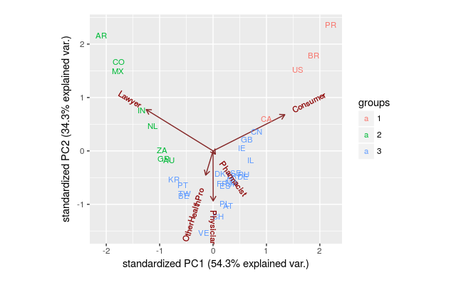

Exploration of FDA adverse event reports
================

The FDA's database of adverse event reports contains any undesirable experience associated with the use of a medical product in a patient.

After some exploratory analysis, I will analyze whether different adverse events are reported in different countries (question 1 in the instructions).

``` r
# For plotting, data clean up and manipulation
suppressWarnings(suppressMessages(library(tidyverse)))
suppressWarnings(suppressMessages(library(scales)))
library(ggbiplot)
# Some helpers for accessing the OpenFDA API
# Instlled from https://github.com/rOpenHealth/openfda
library("openfda")
# The API key from https://open.fda.gov/
API_KEY="GsTBXQA24P3pKrqNB8sO6qXLD0u6UbHPcBsrDvGU"
```

I will do some initial exploratory analysis first and then dive into the specifics. There are some interesting pieces to see in this analysis:

``` r
gdr_submitter <- fda_query("/drug/event.json") %>%
                  fda_api_key(API_KEY) %>%
                  fda_count("patient.patientsex")  %>%
                  fda_exec();
```

    ## Fetching: https://api.fda.gov/drug/event.json?search=&api_key=GsTBXQA24P3pKrqNB8sO6qXLD0u6UbHPcBsrDvGU&count=patient.patientsex

``` r
# Some reformatting 
gdr_submitter$term <- as.factor(gdr_submitter$term)
levels(gdr_submitter$term) <- c("Unknown","Male","Female")
names(gdr_submitter) <- c("Gender","Count")

ggplot(gdr_submitter,aes(x=Gender, y=Count, fill=Gender)) +
    geom_bar(colour="black", stat="identity") +
    guides(fill=FALSE) + ggtitle("patient.patientsex") 
```

 Almost twice as many reports were submitted by women than by men.

``` r
age_submitter <- fda_query("/drug/event.json") %>%
                 fda_api_key(API_KEY) %>%
                 fda_count("patient.patientonsetage")  %>%
                 fda_exec();
```

    ## Fetching: https://api.fda.gov/drug/event.json?search=&api_key=GsTBXQA24P3pKrqNB8sO6qXLD0u6UbHPcBsrDvGU&count=patient.patientonsetage

``` r
names(age_submitter) <- c("Age","Count")

ggplot(age_submitter,aes(x=Age, y=Count, fill=Age)) +
    geom_point() +
    geom_vline(aes(xintercept = median(age_submitter$Age))) +
    guides(fill=FALSE) + ggtitle("patient.patientonsetage") 
```

 The median age of submitters is relatively high, 50 years.

``` r
reac <- fda_query("/drug/event.json") %>%
        fda_api_key(API_KEY) %>%
        fda_count("patient.reaction.reactionmeddrapt.exact")  %>%
        fda_exec();
```

    ## Fetching: https://api.fda.gov/drug/event.json?search=&api_key=GsTBXQA24P3pKrqNB8sO6qXLD0u6UbHPcBsrDvGU&count=patient.reaction.reactionmeddrapt.exact

``` r
names(reac) <- c("Reaction","Count")
# Show reported reactions sorted by number of occurences in decreasing order
head(reac[order(reac$Count,decreasing = T),])
```

    ##           Reaction  Count
    ## 1 DRUG INEFFECTIVE 397357
    ## 2           NAUSEA 305427
    ## 3            DEATH 278979
    ## 4          FATIGUE 254819
    ## 5         HEADACHE 237045
    ## 6         DYSPNOEA 216127

"Drug ineffective" is the most frequent reported reaction overall, but "Death" is the third most frequent! There are some differences in the number of reported events in each country (data not shown).

After this initial exploration, I decided to focus on the question whether different adverse events are reported in different countries (question 1 in the instructions).

The API references reveals a potential problem: for each reported event, the FDA stores (a) the country in which the event occurred but also (b) the country in which the event was reported. Strictly speaking, these do not have to be the same:

``` r
us_event_occ <- fda_query("/drug/event.json") %>%
             fda_api_key(API_KEY) %>%
             fda_filter("occurcountry.exact","US")  %>%
             fda_count("primarysource.reportercountry.exact") %>%
             fda_exec();
```

    ## Fetching: https://api.fda.gov/drug/event.json?search=occurcountry.exact:US&api_key=GsTBXQA24P3pKrqNB8sO6qXLD0u6UbHPcBsrDvGU&count=primarysource.reportercountry.exact

``` r
# (1) Reporter countries for events that occurred in the US
head(us_event_occ)
```

    ##                    term   count
    ## 1                    US 2660714
    ## 2 COUNTRY NOT SPECIFIED  282861
    ## 3                    GB    7160
    ## 4                    JP     740
    ## 5                    CA     730
    ## 6                    DE     459

``` r
# (2) Events reported outside the US which occured in the US
not_us_rep <- filter(us_event_occ,term!="US" & term!="UNITED STATES")
head(not_us_rep)
```

    ##                    term  count
    ## 1 COUNTRY NOT SPECIFIED 282861
    ## 2                    GB   7160
    ## 3                    JP    740
    ## 4                    CA    730
    ## 5                    DE    459
    ## 6                    PR    361

``` r
# (1) as percentage of (2)
sum(not_us_rep$count)/sum(us_event_occ$count)
```

    ## [1] 0.0997217

But it does not seem to happen very often and I think option (a) is more interesting so I will focus my analysis on that.

For the sake of time, I also decided to restrict the analysis to the year 2015 which is the most recent year for which the FDA has released data.

``` r
countries <- fda_query("/drug/event.json") %>%
             fda_api_key(API_KEY) %>%
             fda_filter("receivedate","[20150101+TO+20151231]") %>%
             fda_count("occurcountry.exact")  %>%
             fda_exec();
```

    ## Fetching: https://api.fda.gov/drug/event.json?search=receivedate:[20150101+TO+20151231]&api_key=GsTBXQA24P3pKrqNB8sO6qXLD0u6UbHPcBsrDvGU&count=occurcountry.exact

``` r
names(countries) <- c("Country","Count")

ctry_top10 <- head(countries[order(countries$Count,decreasing = T),],n=10)

ggplot(ctry_top10,aes(x=Country,y=Count,fill=Country)) +
  geom_bar(stat="identity") +
  ggtitle("Number of adverse reports per country in 2015")
```


``` r
# Extract the list of country names stored in the openFDA database
ctry_names <- countries$Country
#ctry_names <- ctry_names[!(ctry_names=="COUNTRY NOT SPECIFIED")]
```

Not suprisingly, most of the reports come from the US as the FDA is an US american government agency.

In terms of the events reported, I decided to closer examine the primarysource qualification (Category of individual who submitted the report). I believe this could of interest for a pharmaceutical company for several reasons: the submitters of adverse reports are important contacts for follow-up studies. They could also serve as target for marketing campaigns or in clinical trials.

Differences in submitters can also reveal interesting cultural differences or different in the healthcare system of a country.

Let us start by comparing two countries, US and UK:

``` r
qual_levels <- c("Physician","Pharmacist","OtherHealthPro","Lawyer","Consumer")

us_qry <- fda_query("/drug/event.json") %>%
          fda_api_key(API_KEY) %>%
          fda_filter("receivedate","[20150101+TO+20151231]") %>%
          fda_filter("occurcountry.exact","US") %>%
          fda_count("primarysource.qualification") %>%
          fda_exec();
```

    ## Fetching: https://api.fda.gov/drug/event.json?search=receivedate:[20150101+TO+20151231]+AND+occurcountry.exact:US&api_key=GsTBXQA24P3pKrqNB8sO6qXLD0u6UbHPcBsrDvGU&count=primarysource.qualification

``` r
names(us_qry) <- c("Source","Count")
us_qry$Source <- factor(us_qry$Source)
levels(us_qry$Source) <- qual_levels

#print(us_qry[order(match(us_qry$Source, qual_levels)),])
#print(qual_levels)

ggplot(us_qry,aes(x=Source,y=Count,fill=Source)) +
  geom_bar(stat = "identity") + ggtitle("primarysource.qualification in US")
```


``` r
#react_us_qry_top20 <- head(react_us_qry[order(react_us_qry$Count,decreasing=T),],n=20)
#head(react_us_qry_top20)
```

``` r
gb_qry <- fda_query("/drug/event.json") %>%
          fda_api_key(API_KEY) %>%
          fda_filter("receivedate","[20150101+TO+20151231]") %>%
          fda_filter("occurcountry.exact","GB") %>%
          fda_count("primarysource.qualification") %>%
          fda_exec();
```

    ## Fetching: https://api.fda.gov/drug/event.json?search=receivedate:[20150101+TO+20151231]+AND+occurcountry.exact:GB&api_key=GsTBXQA24P3pKrqNB8sO6qXLD0u6UbHPcBsrDvGU&count=primarysource.qualification

``` r
names(gb_qry) <- c("Source","Count")
gb_qry$Source <- factor(gb_qry$Source)
levels(gb_qry$Source) <- qual_levels

#print(gb_qry[order(match(gb_qry$Source, qual_levels)),])
#print(qual_levels)

ggplot(gb_qry,aes(x=Source,y=Count,fill=Source)) +
  geom_bar(stat = "identity") + ggtitle("primarysource.qualification in GB")
```


In both GB and US, consumers submit a large fraction of the adverse events. But in the US, consumers are the largest submitters by a large margin whereas in UK Other Healthcare Professionals and Physicians are also frequent submitters.

``` r
qry_tmp <- fda_query("/drug/event.json") %>%
           fda_api_key(API_KEY) %>%
           fda_filter("receivedate","[20150101+TO+20151231]") %>%
           fda_count("primarysource.qualification");

# number of possible submitters
n_submitter_qual <- length(qual_levels)
# number of countries
n_countries <- length(ctry_names)
# allocate matrix counts of submitter qualifications
qual_ctry <- matrix(ncol=n_countries, nrow=n_submitter_qual)

out_file <- "submitter_qualifications_by_country.csv"

if (file.exists(out_file)) {
  # skip time consuming loop below
  qual_ctry_df <- readr::read_csv(out_file)
  row.names(qual_ctry_df) <- qual_levels[order(match(qry_full$Source,qual_levels))]
} else {
# loop over all countries and retrieve the submitter qualifications
for (idx in 1:length(ctry_names)) {
  ctry <- ctry_names[idx]
  # Some reformatting of country name
  ctry <- gsub(" ", "+", ctry)
  ctry <- gsub(",", "", ctry)
  ctry <- "US"
  qry_full <- qry_tmp %>% 
              fda_filter("occurcountry.exact",ctry) %>%
              fda_exec();
  #print(qual_ctry)
  # Reformat and convert query results
  names(qry_full) <- c("Source","Count")
  qry_full$Source <- factor(qry_full$Source)
  levels(qry_full$Source) <- qual_levels
  # Complete missing factor levels
  qry_full <- tidyr::complete(qry_full,Source,fill=list(Count=0))
  # Sort result for factor qual_levels
  qry_full_sorted <- qry_full[order(match(qry_full$Source,qual_levels)),]
  qual_ctry[,idx] <- qry_full_sorted$Count#/sum(qry_full_sorted$Count)
  
  # Pause after every 10th query to avoid hitting the limit of queries
  if (idx %% 5 == 0) {
    print("PAUSE")
    Sys.sleep(61)
  }

}
qual_ctry_df <- data.frame(qual_ctry)
colnames(qual_ctry_df) <- ctry_names
row.names(qual_ctry_df) <- qual_levels[order(match(qry_full$Source,qual_levels))]
readr::write_csv(qual_ctry_df,out_file)
} 
```

    ## Parsed with column specification:
    ## cols(
    ##   .default = col_integer()
    ## )

    ## See spec(...) for full column specifications.

    ## Warning: Setting row names on a tibble is deprecated.

Let's take a look a closer look at the results:

``` r
# Discard countries with few observations
qual_ctry_df_short <- qual_ctry_df[,colSums(qual_ctry_df) > 1000]
# Divide counts by their sums
qual_ctry_df_short <- sweep(qual_ctry_df_short,2,colSums(qual_ctry_df_short),`/`)
row.names(qual_ctry_df_short) <- row.names(qual_ctry_df)
# Show countries with the highest counts for each covariate
colnames(qual_ctry_df_short)[apply(qual_ctry_df_short,1,which.max)]
```

    ## [1] "AT" "JP" "TW" "AR" "PR"

``` r
row.names(qual_ctry_df_short)
```

    ## [1] "Pharmacist"     "Lawyer"         "OtherHealthPro" "Consumer"      
    ## [5] "Physician"

In Austria (AT), adverse event reports are usually submitted by Pharmacists whereas in Japan (JP), Lawyers tend to submit these reports.

``` r
qual_ctry_cluster <- kmeans(qual_ctry_df_short, 3, nstart = 20)
#str(qual_ctry_cluster)
pca <- prcomp(t(qual_ctry_df_short))
pca_cluster <- kmeans(pca$x[,1:2], 3, nstart = 20)

# biplot of the first two principal components with points coloured
# by cluster membership
ggbiplot(pca,groups=as.factor(pca_cluster$cluster),labels=colnames(qual_ctry_df_short))
```

 The United States, Brazil and Puerto Rico are standing out as the countries with most adverse events submitted by consumers. The second (green) cluster represents countries where Lawyers tend to submit reports. Examples are Argentina (AR) and Mexico (MX). The third (blue) cluster are countries where Pharmacists, Physicians and Other Healthcare Professionals submit reports.
